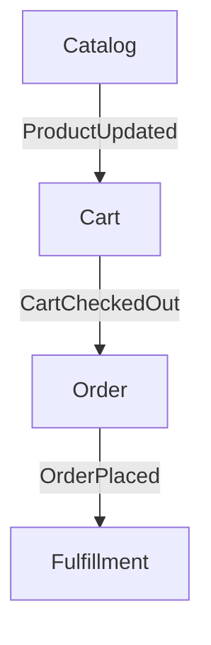

# OKF Bundle: NestJS-Vue

> Object Knowledge Framework bundle template for NestJS + Vue (Nuxt 4) projects.

---

## Files

This template creates the following structure in `projects/{name}/okf/`:

```
okf/
├── index.md              # Project metadata and overview
├── bounded-contexts/     # Per-context documentation
│   └── index.md
├── adr/                  # Architecture Decision Records
│   └── README.md
└── README.md             # OKF usage guide
```

---

## index.md Template

```yaml
---
type: Project
title: "{{PROJECT_NAME}}"
description: "{{PROJECT_DESCRIPTION}}"
project-type: nestjs-vue
tech-stack:
  frontend:
    framework: nuxt
    version: "4"
    state: pinia
    testing: vitest
  backend:
    framework: nestjs
    architecture: cqrs
    database: postgresql
    testing: jest
repo-url: "{{REPO_URL}}"
ci-url: "{{CI_URL}}"
---

# {{PROJECT_NAME}}

## Overview
{{PROJECT_DESCRIPTION}}

## Bounded Contexts
See [bounded-contexts/index.md](bounded-contexts/index.md)

## Architecture Decision Records
See [adr/README.md](adr/README.md)

## Quick Links
- Repository: {{REPO_URL}}
- CI/CD: {{CI_URL}}
```

---

## bounded-contexts/index.md Template

```markdown
# Bounded Contexts

## Context Map



## Contexts

| Name | Responsibility | Status |
|------|---------------|--------|
| Cart | Shopping cart management | 🚧 In Progress |
| Order | Order processing | ⏳ Planned |
| Catalog | Product catalog | ⏳ Planned |
| Fulfillment | Shipping and delivery | ⏳ Planned |
```

---

## adr/README.md Template

```markdown
# Architecture Decision Records

## ADR-001: Technology Stack
- **Status:** Accepted
- **Date:** {{DATE}}
- **Context:** Need full-stack framework for {{PROJECT_NAME}}
- **Decision:** NestJS (CQRS) + Nuxt 4 + PostgreSQL
- **Consequences:** Strong typing, CQRS for complex domain, Vue ecosystem

## ADR-002: Database Strategy
- **Status:** Accepted
- **Date:** {{DATE}}
- **Context:** Need relational database for transactional consistency
- **Decision:** PostgreSQL with TypeORM
- **Consequences:** ACID transactions, good CQRS support, team familiarity
```

---

## Usage

```bash
# Initialize from template
/framework:init-project --name <name> --type nestjs-vue

# This copies the template to projects/<name>/okf/
# Then edit index.md, bounded-contexts/, and adr/ with project specifics
```
