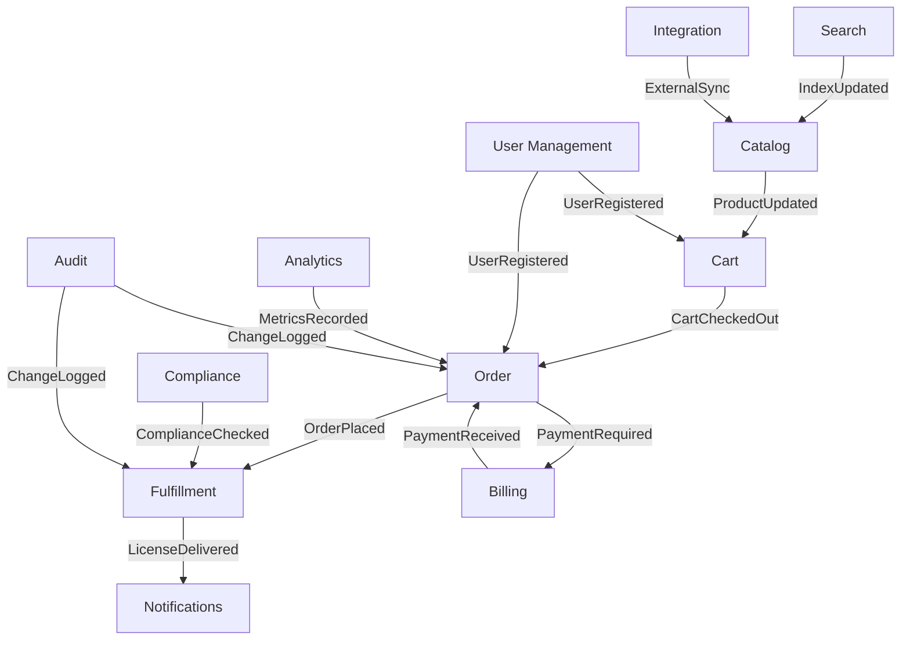

# Bounded Contexts

> Domain boundaries and context map for IP Hub.

---

## Context Map

---

## Contexts

### Cart 🚧
- **Responsibility:** IP asset selection, pricing, and checkout
- **Aggregate Root:** Cart
- **Key Entities:** Cart, CartItem, PricingRule
- **Status:** In Progress

### Order ⏳
- **Responsibility:** License/purchase order processing
- **Aggregate Root:** Order
- **Key Entities:** Order, OrderLine, Payment
- **Status:** Planned

### Catalog ⏳
- **Responsibility:** IP asset catalog and faceted search
- **Aggregate Root:** IPAsset
- **Key Entities:** IPAsset, Category, Tag
- **Status:** Planned

### Fulfillment ⏳
- **Responsibility:** License delivery and activation
- **Aggregate Root:** License
- **Key Entities:** License, Delivery, Activation
- **Status:** Planned

### User Management ⏳
- **Responsibility:** Authentication, profiles, permissions
- **Aggregate Root:** User
- **Key Entities:** User, Role, Permission
- **Status:** Planned

### Billing ⏳
- **Responsibility:** Invoicing, payments, subscriptions
- **Aggregate Root:** Invoice
- **Key Entities:** Invoice, Payment, Subscription
- **Status:** Planned

### Search ⏳
- **Responsibility:** Full-text and faceted search
- **Aggregate Root:** SearchIndex
- **Key Entities:** SearchIndex, Facet, Filter
- **Status:** Planned

### Notifications ⏳
- **Responsibility:** Email, SMS, in-app alerts
- **Aggregate Root:** Notification
- **Key Entities:** Notification, Template, Channel
- **Status:** Planned

### Analytics ⏳
- **Responsibility:** Usage metrics and reporting
- **Aggregate Root:** Report
- **Key Entities:** Report, Metric, Dashboard
- **Status:** Planned

### Compliance ⏳
- **Responsibility:** Regulatory requirements and validation
- **Aggregate Root:** ComplianceRule
- **Key Entities:** ComplianceRule, Jurisdiction, Regulation
- **Status:** Planned

### Audit ⏳
- **Responsibility:** Change tracking and audit logs
- **Aggregate Root:** AuditLog
- **Key Entities:** AuditLog, ChangeSet, Snapshot
- **Status:** Planned

### Integration ⏳
- **Responsibility:** Third-party connectors (WIPO, USPTO, etc.)
- **Aggregate Root:** Integration
- **Key Entities:** Integration, Connector, SyncJob
- **Status:** Planned

---

## Integration Patterns

All cross-context communication uses:
- [[.framework/patterns/domain-events\|Domain Events]] for async communication
- [[.framework/patterns/pact-contract-testing\|Pact Contracts]] for API boundaries

---

## Related

- [[projects/ip-hub/okf/index\|IP Hub Overview]]
- [[projects/ip-hub/okf/adr/README\|Architecture Decision Records]]
